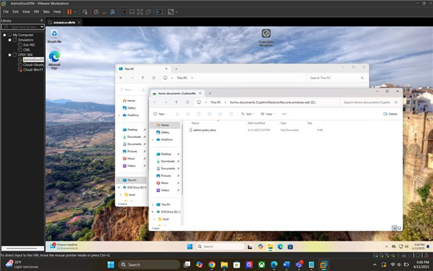
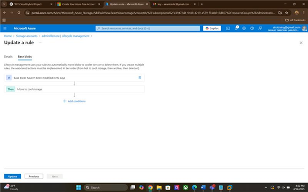

# Administrative Department (RG-Admin)

This guide documents how we built **RG-Admin** for the Administrative Department, grouped users, enforced least privilege, created Azure Files with **lifecycle tiering**, and validated permissions from a Windows 11 VM.

## Goals
- Department isolation via `RG-Admin`
- Group-based access: **AD-Users**, **AD-Directors**, **AD-OfficeStaff**
- Least-privilege RBAC on Azure Files
- Cost optimization with lifecycle tiering (Hot → Cool)
- Usability demo: map SMB share, test NTFS permissions

## 1) Resource Group & Entra ID Groups

**Resource Group:** `RG-Admin`

**Groups**
- `AD-Users` – all department users  
  - Owner: Director
  - Members: Director + Office Staff
- `AD-Directors` – Directors only
- `AD-OfficeStaff` – Office staff only

## 2) RBAC at the RG level

- **Directors** → `Owner` on `RG-Admin`
- **Office Staff** → (no wide RG privilege; scoped privileges are set on the storage/file share below)

_Azure Portal → RG-Admin → Access Control (IAM) → Add role assignment_

## 3) Create Storage & File Share

**Storage account**  
Portal → **Storage accounts** → **Create**  
- RG: `RG-Admin`  
- Name: `adminfilestore`  
- Performance: **Standard**  
- Redundancy: **GRS** (DR readiness)

**File share**  
Storage account → **Data storage** → **File shares** → **+ File share**  
- Name: `forms-documents`  
- Defaults OK → Create

## 4) Least-Privilege Roles on the Share

Storage account → **Access control (IAM)** → **Add role assignment**

- **Directors**  
  - Role: **Storage File Data SMB Share Elevated Contributor**  
  - Members: `AD-Directors`  
  - Rationale: can modify NTFS ACLs and manage share.

- **Office Staff**  
  - Role: **Storage File Data SMB Share Contributor**  
  - Members: `AD-OfficeStaff`  
  - Rationale: read/write files but **cannot** change NTFS permissions.

> Note: An “SMB Share Owner” role doesn’t exist; the elevated contributor covers the needed ACL management for directors.

## 5) Lifecycle Management (Auto-Tiering)

Goal: move inactive files to **Cool** after 90 days.

Storage account → **Data management** → **Lifecycle management** → **Add a rule**  
- Name: `AutoTierAdminDocs`  
- IF: **Last modified** > **90** days  
- THEN: **Move to cool storage**

## 6) Authentication Choice (Scope Note)

Identity-based auth (AAD DS / Entra Kerberos) is preferred in production, but to keep scope manageable we used **access keys** for the demo.

Get key: Storage account → **Access keys** → copy **key1**.

## 7) Join Windows 11 VM & Map the Drive

- Join to Entra ID (OOBE tutorial you used).  
- Install VMware Tools.  
- Map the share in File Explorer:

